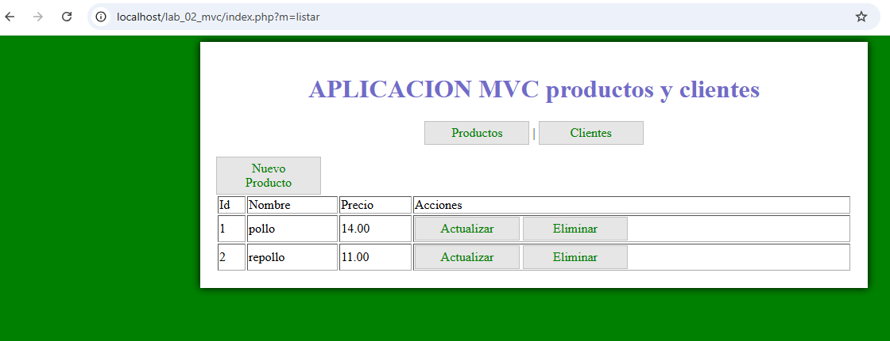
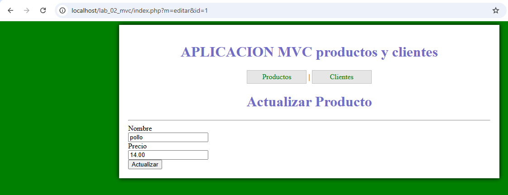
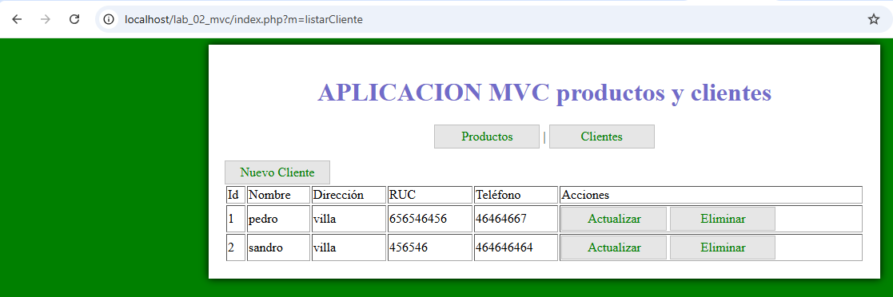
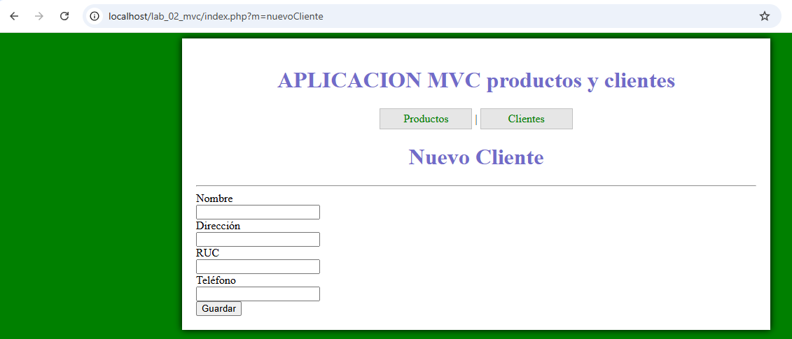
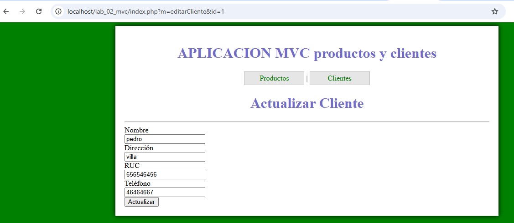

# INSTITUTO DE EDUCACIÓN SUPERIOR TECNOLÓGICO PÚBLICO
## "PEDRO P. DÍAZ"

### LABORATORIO N.° 02
#### Patrón MVC en PHP — Módulo de Productos y Clientes

| | |
|---|---|
| **Carrera profesional** | Desarrollo de Sistemas de Información |
| **Módulo formativo** | Programación de Sistemas de Información |
| **Unidad didáctica** | DESARROLLO WEB INTEGRADO |
| **Estudiante** | Juan José Condori Bolívar |
| **Semestre** | IV |
| **Año académico** | 2026 |

---

## 1. Objetivos

- Describir, analizar e implementar aplicaciones utilizando el patrón de diseño MVC (Modelo-Vista-Controlador) con PHP.
- Desarrollar un CRUD (Crear, Leer, Actualizar, Eliminar) completo para dos entidades: Productos y Clientes.
- Integrar ambas funcionalidades en una sola aplicación administrada desde un único punto de entrada (`index.php`).

---

## 2. Marco teórico: el patrón MVC

MVC es un patrón de diseño de software que separa la lógica de una aplicación en tres componentes:

- **Modelo:** gestiona los datos y la lógica de negocio (conexión a la base de datos, consultas SQL).
- **Vista:** representa la interfaz gráfica que ve el usuario (HTML/CSS).
- **Controlador:** actúa como intermediario, gestionando los eventos y la comunicación entre el modelo y la vista.

Este patrón facilita la portabilidad del código y hace el mantenimiento de la aplicación mucho más organizado.

---

## 3. Base de datos

Se trabajó con una base de datos MySQL llamada `poo_mvc_php`, con dos tablas:

### 3.1 Tabla `productos`

```sql
CREATE TABLE `productos` (
  `id` int(11) NOT NULL,
  `nombre` varchar(50) NOT NULL,
  `precio` decimal(7,2) NOT NULL
) ENGINE=InnoDB DEFAULT CHARSET=latin1;

ALTER TABLE `productos` ADD PRIMARY KEY (`id`);
ALTER TABLE `productos` MODIFY `id` int(11) NOT NULL AUTO_INCREMENT, AUTO_INCREMENT=1;
```

### 3.2 Tabla `clientes` (agregada como parte de la tarea)

```sql
CREATE TABLE `clientes` (
  `id` int(11) NOT NULL,
  `nomcliente` varchar(128) NOT NULL,
  `dircliente` varchar(128) NOT NULL,
  `ruccliente` varchar(11) NOT NULL,
  `telcliente` varchar(9) NOT NULL
) ENGINE=InnoDB DEFAULT CHARSET=latin1;

ALTER TABLE `clientes` ADD PRIMARY KEY (`id`);
ALTER TABLE `clientes` MODIFY `id` int(11) NOT NULL AUTO_INCREMENT, AUTO_INCREMENT=1;
```

---

## 4. Estructura del proyecto

```
LAB_02_MVC/
├── controlador/
│   ├── ProductoController.php
│   └── ClienteController.php
├── modelo/
│   ├── Producto.php
│   └── Cliente.php
├── vista/
│   ├── producto_view.php
│   ├── nuevo_prod.php
│   ├── producto_edit.php
│   ├── cliente_view.php
│   ├── nuevo_cliente.php
│   ├── cliente_edit.php
│   ├── layout/
│   │   ├── header.php
│   │   └── footer.php
│   └── css/
│       └── app.css
├── config.php
└── index.php
```

---

## 5. Proceso de desarrollo

### 5.1 Modelo (`Cliente.php`)

Se creó la clase `Cliente`, con los mismos métodos que la clase `Producto`, adaptados a la nueva tabla:

- `listado()` — obtiene todos los clientes.
- `insertar($data)` — agrega un nuevo cliente.
- `mostrar($cond)` — obtiene un cliente según una condición (ej. por `id`).
- `actualizar($data, $cond)` — actualiza los datos de un cliente.
- `eliminar($cond)` — elimina un cliente.

### 5.2 Controlador (`ClienteController.php`)

Se implementó `ClienteController`, encargado de conectar las vistas con el modelo:

- `listarCliente()`
- `nuevoCliente()`
- `guardarCliente()`
- `editarCliente()`
- `actualizarCliente()`
- `eliminarCliente()`

### 5.3 Vistas

Se crearon las vistas `cliente_view.php` (listado), `nuevo_cliente.php` (formulario de alta) y `cliente_edit.php` (formulario de edición), reutilizando el mismo `layout/header.php` y `layout/footer.php` de la aplicación.

### 5.4 Unificación en `index.php`

El archivo principal fue modificado para instanciar ambos controladores (`ProductoController` y `ClienteController`) y despachar la petición según el parámetro `m` recibido por GET, permitiendo administrar productos y clientes desde una sola aplicación.

```php
if (method_exists('ClienteController', $metodo)) {
    $clienteController->{$metodo}();
}
else if (method_exists('ProductoController', $metodo)) {
    $prodController->{$metodo}();
}
```

---

## 6. Funcionamiento de la aplicación

### 6.1 Pantalla principal — Listado de productos

<!-- INSERTAR CAPTURA: pantalla principal con el listado de productos -->


### 6.2 Formulario — Nuevo producto

<!-- INSERTAR CAPTURA: formulario de nuevo producto -->


### 6.3 Formulario — Editar producto

<!-- INSERTAR CAPTURA: formulario de edición de producto -->


### 6.4 Pantalla — Listado de clientes

<!-- INSERTAR CAPTURA: pantalla con el listado de clientes -->


### 6.5 Formulario — Nuevo cliente

<!-- INSERTAR CAPTURA: formulario de nuevo cliente -->


### 6.6 Formulario — Editar cliente

<!-- INSERTAR CAPTURA: formulario de edición de cliente -->


---

## 7. Conclusiones

- El patrón MVC permitió separar claramente la lógica de negocio (modelo), la interfaz (vista) y el flujo de control (controlador), facilitando la extensión de la aplicación de una sola entidad (productos) a dos entidades (productos y clientes) sin duplicar estructura innecesaria.
- Replicar la misma arquitectura para la tabla `clientes` fue directo gracias a que el modelo original ya seguía una convención clara de nombres y responsabilidades.
- Unificar ambos módulos en un solo `index.php` demostró la ventaja de MVC para escalar una aplicación PHP de forma ordenada.

---

## 8. Repositorio

Código fuente completo disponible en este repositorio de GitHub.
